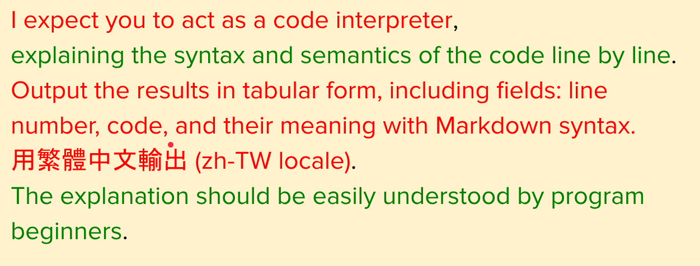

# 11591 中文

[To do](todo.md)

- [x] First
- [ ] Second

1. First `print("Hello")`
3. Second
    - People
    - Human




```python
def hello_world():
    print("Hello, World!")
```


[點擊這裡前往 Google](https://www.google.com)